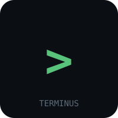

<p align="center">
  
</p>

<h1 align="center">TERMINUS</h1>

<p align="center">
  <strong>Ambientes Alpine Linux descartáveis no browser.</strong><br>
  Sem instalação. Sem backend. Sem conta.<br>
  Abres a página → tens um shell root → fechas o separador → tudo desaparece.
</p>

<p align="center">
  <a href="https://github.com/had-nu/terminus/actions">
    
  </a>
  <a href="LICENSE">
    
  </a>
  <a href="docs/SPEC.md">
    
  </a>
  <a href="docs/spec/README.md">
    
  </a>
</p>

---

## O que é

O TERMINUS dá-te um **ambiente Linux completo no browser** — kernel Alpine 3.22 (x86), userspace com `apk`, `busybox`, ferramentas de rede e diagnóstico — tudo a correr num **Web Worker** via **v86** (emulador x86 → WASM JIT).

**Nada fica no teu disco. Nada sai do teu browser.**

| O que tens | O que NÃO tens |
|------------|----------------|
| Shell root (`/bin/sh`) funcional | Instalação, Docker, VM, conta |
| `apk add nmap tcpdump strace` | Backend, base de dados, estado persistente |
| Rede (loopback, DNS, HTTP) | Egresso livre — só assets de primeira parte |
| Ficheiros, pipes, redirecção, job control | Garantia de performance nativa |
| Receitas prontas (sec, forense, OSINT, etc.) | x86_64 (v86 é 32-bit only) |

> **Nothing to install. Nothing to maintain. Nothing to clean up.**

---

## Quickstart

### 1. Clona e constrói (artefactos reprodutíveis, pins sha256)

```bash
git clone https://github.com/had-nu/terminus.git
cd terminus
npm run build:p0          # fetch + verify + initramfs + vendor v86 (~30s)
npm run dev               # servidor estático em http://localhost:8000
```

### 2. Abre no browser

```
http://localhost:8000/apps/web/index.html
```

Vês o kernel a fazer boot (~30s primeira vez, ~8s com cache), aparece o prompt:

```
TERMINUS P0 - Alpine Linux 3.22.6 (x86)
browser -> runtime -> Alpine -> /bin/sh
/bin/sh: can't access tty; job control turned off
terminus:~#
```

### 3. Usa

```bash
# Informação do sistema
terminus:~# cat /etc/alpine-release
3.22.6
terminus:~# uname -m
i686

# Instala ferramentas (apk funciona offline com mirror local)
terminus:~# apk add nmap tcpdump htop strace

# Diagnóstico de rede
terminus:~# tcpdump -i lo -n
terminus:~# nmap -sS 127.0.0.1

# Forense rápida
terminus:~# ls -la /proc/self/fd
terminus:~# cat /proc/meminfo
```

### 4. Destroi

Botão **Destroy Session** na UI — ou fecha o separador. **Tudo desaparece.** Zero rasto.

---

## Receitas (environments prontos)

Cada receita = `environment.yaml` declarativo (base image + lista de pacotes `apk`). Carregas e tens o toolset pronto.

| Receita | Foco | Pacotes-chave |
|---------|------|---------------|
| `network-research` | Reconhecimento de rede | `nmap`, `masscan`, `zmap`, `traceroute`, `dnsutils` |
| `web-security` | Auditoria de apps web | `nikto`, `sqlmap`, `gobuster`, `ffuf`, `wafw00f` |
| `malware-analysis` | Análise estática/dinâmica | `yara`, `binwalk`, `volatility3`, `radare2` |
| `digital-forensics` | Forense de disco/memória | `sleuthkit`, `autopsy`, `volatility3`, `bulk-extractor` |
| `osint` | Inteligência de fontes abertas | `theharvester`, `sherlock`, `social-analyzer`, `photon` |
| `linux-fundamentals` | Aprender Linux | `vim`, `htop`, `man`, `bash-completion`, `lsof`, `strace` |

```bash
# Ver receitas disponíveis
ls recipes/

# Cada ficheiro .yaml é legível — base + packages
cat recipes/web-security.yaml
```

---

## Como funciona (30 segundos)

```
┌─────────────────────────────────────────────────────────────┐
│                      O TEU BROWSER                           │
│  ┌──────────────────┐         ┌──────────────────────────┐  │
│  │  Main Thread     │         │  Web Worker (isolado)    │  │
│  │  (UI / xterm.js) │ ←──→    │  v86 (x86 → WASM JIT)    │  │
│  │                  │ postMsg │  Alpine kernel + initrd  │  │
│  └──────────────────┘         │  serial console (ttyS0)  │  │
│                               └──────────────────────────┘  │
└─────────────────────────────────────────────────────────────┘
```

- **Main thread** = só UI. React + xterm.js (P1), botões, estado de sessão.
- **Web Worker** = runtime Linux completo. Kernel 32-bit, userspace Alpine, serial bridge.
- **Comunicação** = `postMessage` / `MessageChannel` (protocolo tipado em `packages/protocol`).
- **Persistência** = **zero**. Worker morre → sessão morre → nada no disco.

---

## Requisitos

| Requisito | Mínimo |
|-----------|--------|
| Browser | Firefox 108+, Chrome 108+, Safari 16.4+, Edge 108+ |
| WASM | ✅ (todos os browsers modernos) |
| SharedArrayBuffer | ❌ **não necessário** (v86 não usa) |
| COOP/COEP headers | ❌ **não necessário** |
| Memória RAM | ~300 MB livres (256 MB guest + overhead) |
| Rede | Apenas para carregar a página inicial (depois offline) |

> **Nota:** v86 emula **x86 de 32-bit apenas** (Pentium 4-class). O Alpine `x86` (i686) é a porta suportada — não x86_64.

---

## Scripts disponíveis

| Comando | O que faz |
|---------|-----------|
| `npm run build:p0` | Constrói tudo: rootfs + initramfs + vendor v86 (pins sha256) |
| `npm run build:rootfs` | Só rootfs/initramfs (fetch Alpine + assemble) |
| `npm run build:runtime` | Só vendor v86 + BIOS (npm pack, verifica hash) |
| `npm run dev` | Servidor estático em `http://localhost:8000` |
| `npm run test:p0` | Headless test (Playwright + Chromium) — evidência de boot |

Os scripts de build são **reprodutíveis**:
- Pins de versão + sha256 no topo de cada script
- Falham se o hash não bater (supply-chain protection)
- Artefactos gerados em `runtime/` (gitignored — reconstrói com `npm run build:p0`)

---

## Estrutura do projeto

```
terminus/
├── apps/web/              # P0: vanilla spike (index.html + worker); P1: React + xterm.js
├── runtime/
│   ├── alpine/            # Kernel, initramfs, rootfs, BIOS (reconstruídos pelos scripts)
│   ├── wasm/              # v86 runtime (vendored, pinned)
│   └── filesystem/        # P2: base imutável + overlay CoW
├── packages/
│   ├── protocol/          # Mensagens tipadas main↔worker
│   ├── session/           # Lifecycle NEW → DESTROYED
│   └── terminal/          # xterm wiring (P1)
├── recipes/               # 6 environment.yaml declarativos (D-003)
├── docs/
│   ├── spec/README.md     # Spec amigável (este ficheiro em formato legível)
│   ├── SPEC.md            # Spec técnica completa (local, gitignored)
│   ├── architecture.md    # Arquitectura P0
│   ├── benchmarks.md      # Métricas medidas
│   ├── reproducibility.md # Pins, scripts, verificação
│   ├── spike-p0.md        # Relatório do spike comparativo (v86 vs c2w)
│   └── evidence/          # JSON + screenshot do boot P0
├── scripts/
│   ├── build-rootfs.sh    # Fetch Alpine + verify + initramfs
│   ├── build-runtime.sh   # Vendor v86 + BIOS
│   └── dev.sh             # Servidor estático
├── .github/workflows/     # CI: build + smoke test
├── LICENSE                # AGPL-3.0
└── package.json           # Workspaces + scripts
```

---

## Roadmap (milestones)

| Fase | Entregável | Estado |
|------|------------|--------|
| **P0** | Runtime feasibility — v86 → Alpine → shell em worker | ✅ Done |
| **P1** | Terminal — React + xterm.js + stdin/stdout bridge | 🔜 Próximo |
| **P2** | Filesystem — base imutável + overlay CoW + reset | Planeado |
| **P3** | Package management — `apk` via mirror/local repo | Planeado |
| **P4** | File transfer — upload/download | Planeado |
| **P5** | Resource controls — mem, processos, timeout | Planeado |
| **P6** | Security review + threat model | Planeado |
| **P7** | Public beta — site, docs, exemplos | Planeado |

---

## Documentação

| Ficheiro | Para quê |
|----------|----------|
| [`docs/spec/README.md`](docs/spec/README.md) | **Começa aqui** — visão geral legível (o que é, como funciona, receitas, decisões, métricas, roadmap) |
| [`docs/SPEC.md`](docs/SPEC.md) | Spec técnica completa — decisions log, open questions, Appendix A–C (local, gitignored) |
| [`docs/architecture.md`](docs/architecture.md) | Arquitectura P0 (diagramas, data flow, decisões locked) |
| [`docs/benchmarks.md`](docs/benchmarks.md) | Métricas medidas (payload 13.7 MiB, boot ~31s, 256 MB RAM) |
| [`docs/reproducibility.md`](docs/reproducibility.md) | Pins sha256, scripts, como verificar |
| [`docs/spike-p0.md`](docs/spike-p0.md) | Spike comparativo v86 vs container2wasm (evidência D-006) |
| [`docs/evidence/`](docs/evidence/) | `p0-v86-evidence.json` + `p0-v86-terminal.png` (boot real) |

---

## Contribuir

1. Lê a [`docs/spec/README.md`](docs/spec/README.md) — visão geral.
2. A spec técnica (`docs/SPEC.md`) é a **fonte de verdade** — decisões, open questions, apêndices.
3. Branches: `develop` = integração; `main` = releases; `feat/*` por feature (git-flow).
4. Commits: **Conventional Commits** (`feat:`, `fix:`, `docs:`, `chore:`).
5. CI: `.github/workflows/build.yml` reconstrói artefactos e corre smoke test.
6. PRs contra `develop`; merge `--no-ff`.

---

## Licença

**AGPL-3.0** — ver [`LICENSE`](LICENSE) e decisão [D-007](docs/SPEC.md#d-007).

Binários vendored mantêm as suas licenças:
- **v86** © copy.sh — BSD-2-Clause (`runtime/wasm/LICENSE.v86`)
- **Alpine Linux** © Alpine contributors — GPL-2.0 (kernel) / MIT-ish (userland)